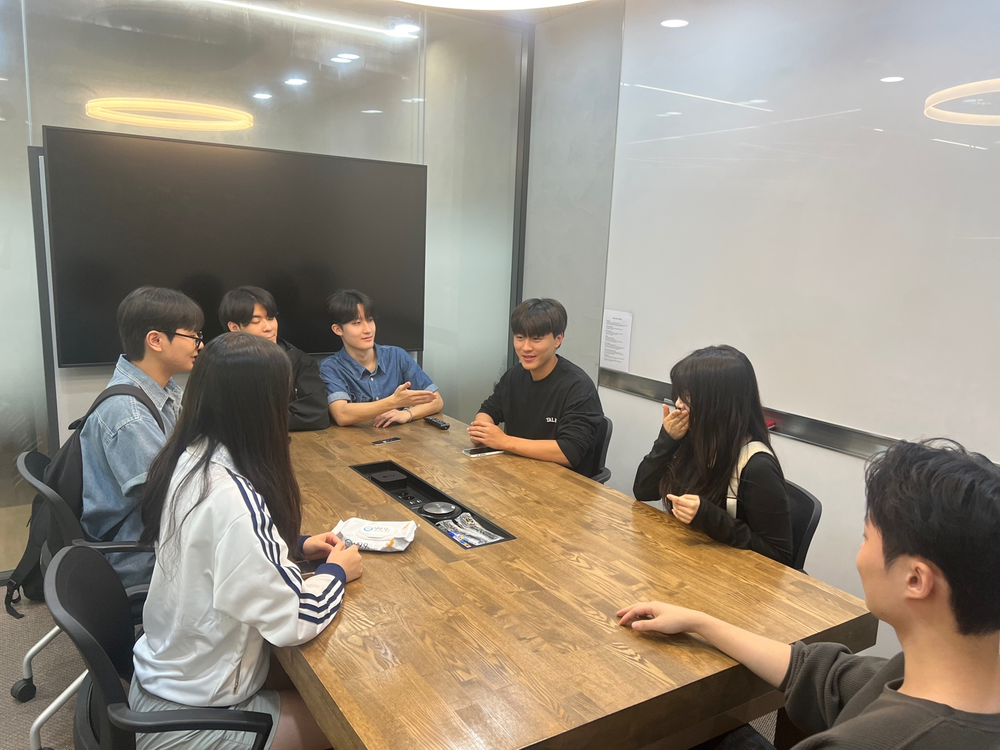
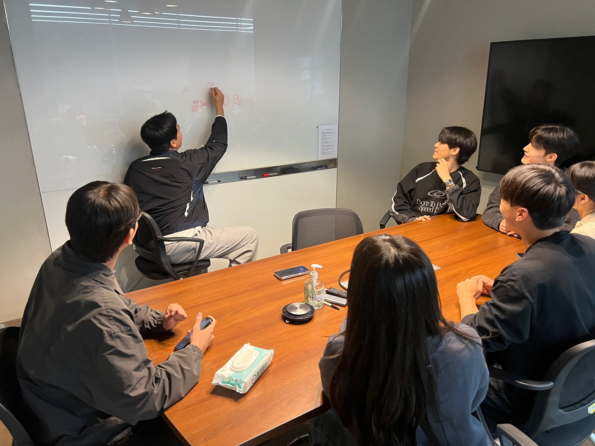
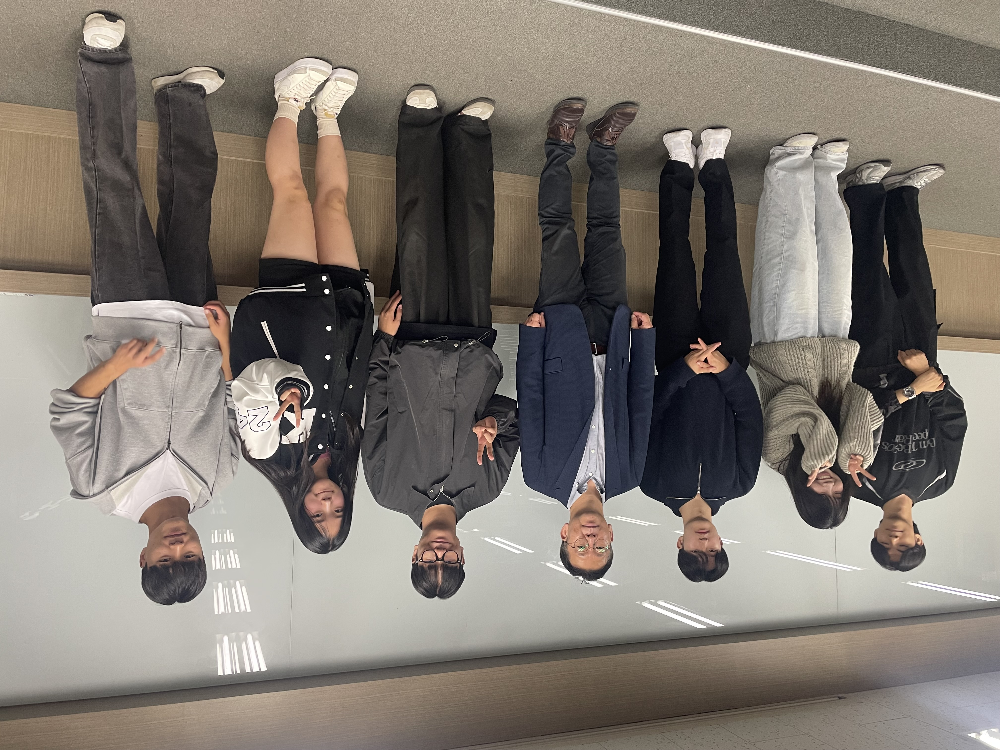
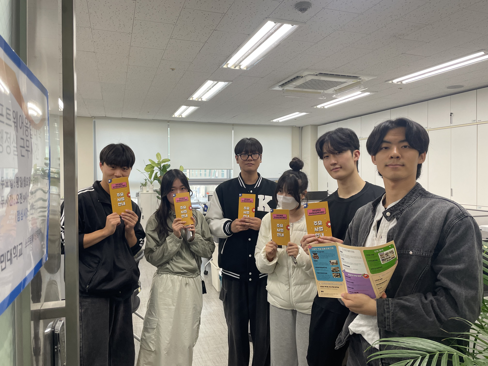
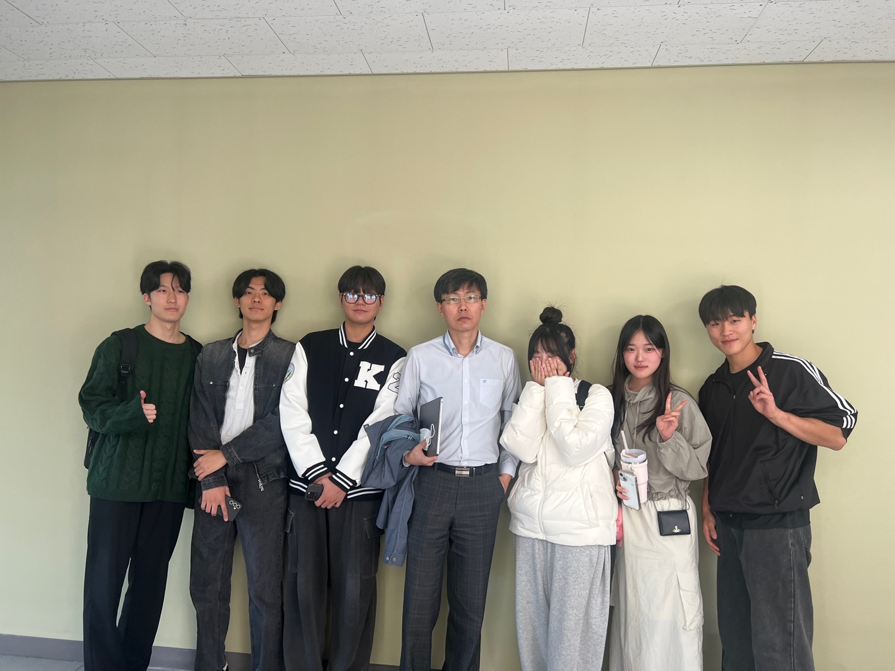
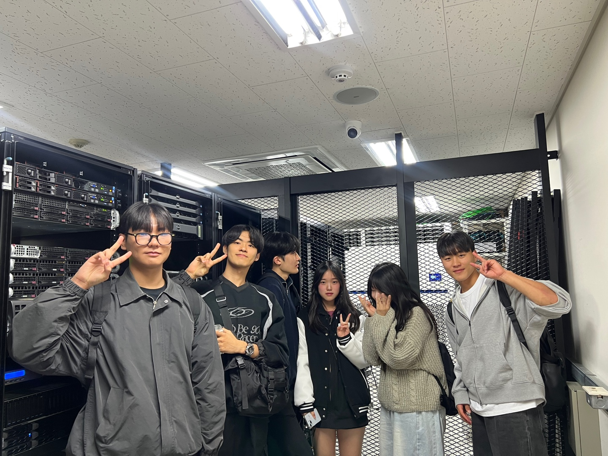
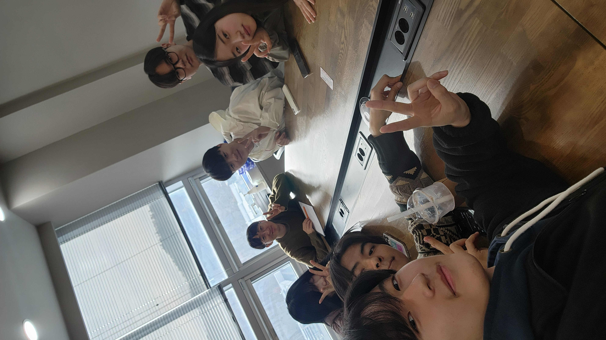

# 유레카 팀 활동 보고서

---

## 🏢 팀 정보

- **프로젝트명**: **2024 유레카 프로젝트**
- **팀명**: **18조**
- **팀 슬로건**: **코드로 CONNECT!**
- **팀원**:
  - **김태일** (팀장)
  - **정다은**
  - **김민성**
  - **송진우**
  - **이채민**
  - **정채은**

---

## 📅 주차별 활동

### **1주차 (9/2 ~ 9/8)**

- 팀 구성 완료
- 프로젝트 방향성과 역할 분담 논의

---

### **2주차 (9/9 ~ 9/15)**

- 팀 발표 준비 및 자료 수집

---

### **3주차 (9/19)**

- **팀 소개 발표**
  - **주제**: 팀원 소개와 목표
  - **목표**: 협력 기반의 코딩 실력 강화

---

### **5주차 (9/30)**

- **분산 데이터 처리 연구실 방문**
  - **인터뷰**: 연구실 선택 과정, 석사 진학 준비
  - **학습 방법**: 부족한 부분을 프로젝트에 적용하며 보완

---

### **6주차 (10/7, 10/10)**

- **정보보안 랩실 방문**

  - **인터뷰**: 보안 분야로 진로 변경 과정, 연구 주제 탐구
  - **학습 방법**: 최신 기술과 기본기 병행

- **보직 교수님 인터뷰 (윤상민 교수님)**
  - **인터뷰**: 교수님이 중점으로 두시는 핵심 역량, 대학원 진학 이유
  - **학습 방법**: 커리큘럼에 맞춘 학습

---

### **9주차 (10/30 ~ 10/31)**

- **행정실 인터뷰**

  - **인터뷰**: 학교 프로그램과 혜택, 도전해볼만한 프로그램
  - **학습 방법**: 코딩역량인증제 참여, 게시판 수시 확인

- **교수님 인터뷰 (주용수 교수님)**

  - **인터뷰**: 필요한 경험과 활동, 차별화를 위한 역량
  - **학습 방법**: 해커톤 참여로 협업과 소통 능력 강화

- **정통처 탐방**
  - **주제**: 클라우드 시스템 효율성과 안정성 질의응답

---

### **12주차 (11/18)**

- **멘토링 시스템 체험**
  - **인터뷰**: 실무 경험, 주목받는 기술, 실무에 도움 되는 과목
  - **학습 방법**: 기초 과목 중요성 인지 및 다양한 경험 탐색

---

### **13주차 (11/25)**

- **3,4학년 과목 담당 교수님 (박하명 교수님)**
  - **인터뷰**: 대학원 진학 이유
  - **학습 방법**: 원하는 분야에 맞춘 학습 설계

---

## 📝 인터뷰 주요 내용

| **인터뷰 대상**             | **핵심 질문**                | **답변**                                 | **사진**                                                                         |
| --------------------------- | ---------------------------- | ---------------------------------------- | -------------------------------------------------------------------------------- |
| **분산 데이터 처리 연구실** | 연구실 기본 역량?            | 클라우드 관련 강의 수강 추천             |                |
|                             | 연구실 선택 이유?            | 흥미 있는 논문 저자가 있는 연구실 선택   |                                                                                  |
| **정보보안 랩실**           | 보안 연구실 진입 계기?       | 웹 개발 과정에서 보안의 필요성 느낀 계기 |                         |
| **윤상민 교수님**           | 학생들에게 필요한 핵심 역량? | 기초 지식 → 심화 학습 → 최신 트렌드 반영 |                          |
| **행정실**                  | 프로그램 정보 확인 방법?     | 공지사항 및 게시판 확인                  |                                 |
| **주용수 교수님**           | 차별화를 위한 역량?          | 소통과 협업 능력 최우선, 문제해결 능력   |  |
| **정통처**                  | DR 방식의 효율성?            | 비용 절감 및 안정성 증가                 |                                 |
| **멘토링 시스템**           | 취업에 도움 되는 과목?       | 알고리즘, 운영체제 등 학과의 기초 과목   |                     |
| **박하명 교수님**           | 대학원 진학에 필요한 목표?   | 연구에 깊은 관심이 있는 경우 적합        |                         |

---

## 🌟 팀원 소감

### 김태일

> **목표**: 사회에 긍정적인 변화를 만드는 개발자  
> **활동 계획**: 연구 프로그램과 인턴십 참여, 인터뷰 통찰 활용

---

### 김민성

> **목표**: 글로벌 소프트웨어 개발자  
> **활동 계획**: 프로그래밍 기초, 실무 프로젝트, 영어 능력 강화

---

### 송진우

> **목표**: 게임 개발자  
> **활동 계획**: 해외 연수, 교수님과 선배 조언 수렴

---

### 정다은

> **목표**: 다양한 방면에서 유능한 인재로 성장  
> **활동 계획**: 학교 프로그램 적극 활용

---

### 정채은

> **목표**: 철저한 미래 계획으로 뛰어난 개발자로 성장  
> **활동 계획**: 다양한 경험을 통해 문제 해결 역량 강화

---

### 이채민

> **목표**: 팀과 협력하며 문제를 해결하는 주체적 개발자  
> **활동 계획**: 학과 커리큘럼과 팀 과제를 통해 성장

---

## 🤔 느낀점

- 다양한 인터뷰와 탐방을 통해 학문적, 실무적 통찰을 얻음.
- 팀원 간 협업이 목표 달성의 중요한 밑바탕이 됨.
- 선배와 교수님의 조언을 바탕으로 진로 방향성을 구체화할 수 있었음.

---

감사합니다! 😊
